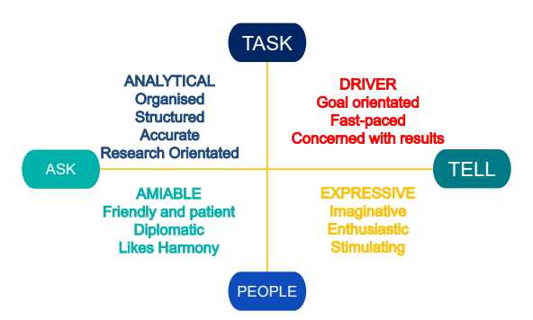

# N8CIR RSE Leaders and Aspiring Leaders Event Feb 2026

Well that was another whistle stop tour of all the goings on at the leadership and strategic level of RSE teams across the N8. It was a great turnout of RSE leaders and aspiring leaders from across the N8CIR.
We covered everything from growing teams, working with other departments to develop finance policies, data management, agile and evidence based project management, influencing styles and ending with a dip into the latest responses to AI.

Many thanks to [Sorrel Harriet](https://www.linkedin.com/in/sorrelharriet/) and the [University of Leeds](https://www.linkedin.com/company/university-of-leeds/) RSE team for helping set up the event. Thanks to our workshop leads [Kate Jennings Coaching](https://www.linkedin.com/company/kate-jennings-coaching/) and [Martin Callaghan](https://www.linkedin.com/in/martin-c-6a4631231/), and our speakers [Phil Harrison](https://www.york.ac.uk/it-services/tools/research/research-it/software-engineers/), [Adrian Harwood](https://www.linkedin.com/in/adrianharwood/), [Paul Graham](https://www.linkedin.com/in/paul-graham-59026513/), [Patricia Ternes](https://www.linkedin.com/in/patricia-ternes/), Adina Rahim(UofManchester), Phil Bradbury(UofManchester).

If you would like to contribute or comment on this blog post please head to the [github copy](https://n8-cir.github.io/rse-knowledge-sharing/rse-knowledge-sharing/blog-posts/2026/02/N8CIR%20RSE%20Leaders%20Event%20Feb%202026.html).

**The process for writing this blog post including GenAI.** Details below:

>	Shorthand minutes were taken by Sam Bland at the meeting. After the meeting these were grouped into key categories and expanded upon with support from the presentation slides used. This was edited into a rough draft blog post. Each section was then copied to an Enterprise version of Google Gemini that does not retain the data. Outputs feedback from Gemini was used to refine the blog into its final state.

## Agenda

**Morning**: Presentation led open discussions

### Philip Harrison - University of York Update and Setting the Scene
I oversee the deployment of RSEs across research projects and advise academics on the support and facilities available at the University. I’m particularly interested in helping researchers in the Arts, Humanities, and Social Sciences use computing tools and technology. I also develop software, typically for projects involving speech and audio across a range of departments. My background is in acoustic engineering, linguistics, and forensic science.

### Adrian Harwood - How internally developed CapX has helped the Manchester RSE team
Since 2022, Adrian has been the Head of Research Software Engineering, leading a department of 50 engineers with annual income streams totalling around £2.5m. The department has over 70 active projects and many more in the pipeline bringing the department portfolio to roughly 100 projects with researchers across the whole University as well as national and international collaborators.

### Patricia Ternes
Dr Patricia Ternes leads the Research Computing Team at the University of Leeds, supporting high-quality research through research software engineering and high-performance computing. She fosters collaboration between research colleagues, IT Services, and the broader university community to ensure that computational research is sustainable, impactful, and aligned with future needs.

**Post lunch:** Presentations and Workshops

### Adina Rahim
Adina is a Research Software Engineer in Research IT at the University of Manchester. She presented on the DisCouRSE funded project Agile Leadership Training for Digital Research Technical Professionals: An Integrated Pilot. This project addresses a recognised gap in Agile leadership training for digital Research Technical Professionals (dRTPs) across University College, London (UCL) and N8 institutions.

### Phil Bradbury
Phil is a Research Software Engineer in Research IT at the University of Manchester. He presented on CapX and the DisCouRSE funded project Establishing an operational management community of practice for dRTP leaders. CapX helps teams plan resources, manage operations, and report on impact using integrated data models.

**Workshops:**

### Workshop 1: Increasing Influence and Impact for RSE Leaders and Aspiring Leaders
Led by: [Kate Jennings](https://www.katejenningscoaching.co.uk)
A practical, interactive workshop that helps RSE leaders and aspiring leaders strengthen their influence, engage key stakeholders with confidence, and increase their impact without relying on formal authority.

### Workshop 2: The "Post-Boilerplate" RSE Team: Balancing Structure, Skills, and Integrity in the Age of AI

Led by: [Martin Callaghan](https://profiles.open.ac.uk/martin-callaghan)
As a community, we have successfully documented (if not solved) the challenges (career progression, funding, project acquisition) to the RSE community. One of our next steps is to agree on the solutions in a landscape that is being shifted by Generative AI.

## A morning of intense discussion

We started the day with the an inevitable offloading of recent challenges, introductions to those new to the leadership space and a little background on previous discussions.

This event was a follow on of an in person meetup between RSE leaders in March 2025 where we brainstormed the challenges and solutions of each RSE team. This was in intense day where we established approaches at each institution to the following challenges:
- RSE Team Career Progression
- Employment Contracts
- Funding and financial management
- Impact Reporting
- Project Acquisition
- Project Management
- Recruitment
- Skills and Competencies
- Team Structure
- Training
A breakdown of those discussions can be found in the [RSE Leaders Evidence Bank](https://github.com/RSE-leaders/evidence-bank/pull/15).

The morning session involved an open discussion in parallel to presentations from Phil Harrison (University of York) and Adrian Hardwood (University of Manchester) and Patricia Ternes (University of Leeds). In these presentations we heard about how team structures, finance models, recruitment and career pathways are changing at each institutions. The parallel approach involved open discussion after each slide. This was a successful approach to stimulating discussion in response to parts of the presentation. This also meant limited additional facilitation was required and the discussion could be led by a combination of those present and the presenters.

###  Technical Data Management
To start the morning we discussed different technical approaches to data management and how the RSE teams were involved.
A number of supporting tools were discussed including Globus and Starfish that have been deployed at a number of institutions. Globus has been an effective method of transferring data between systems and project collaborators. This has been restricted where setting up or connecting to Globus at the partner site has been too onerous for the external organisation. Work is ongoing to implement Starfish as a tool to help link data to associated meta data including retention policies, handling duplicated data and data ownership. Unfortunately at this stage the price of licencing this for HPC related data is prohibitive.

Expanding teams have begun to incorporate technical research data roles in their teams. Role descriptions for new data engineers has been allowed to grow with the person. This has ensured that the role advert is open enough to not restrict applicants and can allow the successful applicant to adapt the role to their own skills and interests. So far this has involved the data engineer being embedded in a data heavy project to use as a case study to establish best practice technical research data management.
Work is ongoing to create more connections between this work and central research data management teams based in the Library. The library have limited data storage but more expertise in funder, ethical, legal and other responsibilities. There is also a separate team within IT services that manage data across the university.

**The Economics of Storage** A major topic of debate was the sustainability of storage funding. Models vary significantly:

- **Free at point of use:** This simplifies management for researchers but obscures the true cost of data, making it difficult to balance funding requirements. It also creates a culture where researchers assume storage costs cannot or should not be added to grant applications.
- **Chargeback models:** Recovering costs via grants is difficult, particularly regarding "sunk costs." If storage hardware was purchased previously, it is often bureaucratically difficult to assign those costs to a new grant project in a way that satisfies funder auditing.

### Financial Management and Investment
Financial management for RSE teams remains a significant challenge. Leaders must find models that fit existing university systems without restricting researcher access or violating funder requirements.
Approaches to this are constantly changing and although some institutions are restricted to Directly Incurred funding models, others have changed their team funding model to be primarily Directly Allocated. This makes them more inline with other IT services and infrastructure costing models. This model has benefits for reducing general admin overhead particularly by the RSE teams. It does however result in a more fixed amount of allocated money with any changes resulting in a lot more admin.
**Directly Incurred vs. Directly Allocated**
While some institutions are restricted to **Directly Incurred (DI)** funding models, others have transitioned to a **Directly Allocated (DA)** approach. This aligns RSE teams more closely with IT services and infrastructure costing. The primary benefit of the DA model is the reduction in administrative overhead for RSE teams; however, it results in a more rigid budget where any mid-year changes trigger significant administrative hurdles.

**The TRAC Model and Budgeting**
Teams operating as a [TRAC](https://www.ukri.org/wp-content/uploads/2022/11/UKRI-281122-QuickGuideTransparentApproachCostingTRAC.pdf) facility reported a benefit from built-in "slack" but must provide accurate estimates at the start of the financial year. As long as the year-end balance aligns with these projections, the model remains stable. However, budgets typically reset annually with no rollover.

**Overheads and Risk Management** Approaches to recovering overheads and projecting budgets vary. Institutions are managing the risks of double-charging and the danger of hiring staff without guaranteed long-term funding. Some have begun applying overheads to bids in line with TRAC methodology, which states:

> _"Research technicians should be excluded when specific to a project and instead included as a separate charge-out rate" (TRAC 4.2.4.9)._ Notably, non-project costs—such as sick leave or maternity leave—often cannot be charged to funders, though these rules vary by agency. [TRAC v2.7 Chapter 4 TRAC reporting](https://www.trac.ac.uk/wp-content/uploads/2022/09/TRAC-v2.7-Chapter-4-TRAC-reporting.pdf)

Other higher risk investment focused work such as training hubs, infrastructure and data management are also limited by risk averse university finance systems. A strong justification is needed to show that they are sustainable beyond the investment. Capital costs investment however has been easier to access than investment in people.

**The Looming SaaS/DaaS Debt**
Another cost that is looming and in some cases has caught up with universities is the reliance on free SaaS and DaaS models where software licences and data storage have been provided free or at a low cost by external suppliers. Google Drive and Github have been highlighted as currently high risk applications that are heavily relied upon by institutions. We discussed options including moving away from these platforms as well as maintaining a contingency fund to reduce the risk exposure should these platforms become cost prohibitive.

In addition to external provider costs there are also ongoing internal costs that extend beyond the timeline of funded projects such as the ongoing hosting and maintenance of web apps. Some institutions have responded to this by including these costs as team overheads which must be cost recovered in future grants.

**Related resources:**
[UKRI-281122-QuickGuideTransparentApproachCostingTRAC.pdf](https://www.ukri.org/wp-content/uploads/2022/11/UKRI-281122-QuickGuideTransparentApproachCostingTRAC.pdf)

### Recruitment and Load Balancing
There are still challenges related to balancing supply and demand of RSE time. Adrian Harwood presented some data from their initial use of CapX to show the delay between changes in demand and in RSE time capacity. This issue was reflected by anecdotal evidence from other RSE leaders. As mentioned previously this is strongly influenced by low appetite for risk and investment in new hires prior to funding being confirmed. Funding models also affect this when work must be invoiced after completion.
This combined with long lead times for recruitment can result in a large gap in capacity at the start of the project and then a surplus of capacity when the project has completed. Some institutions define a limit to surplus FTE as 2.0.
This was also discussed in more detail in our **Recruitment and Diversity online Workshop in January** link to follow.

### Team Structure
As N8 RSE teams have expanded over the past year, team structures have had to adapt. While every team maintains a core of project-focused RSEs, in most institutions led by at least one Senior or Lead, the internal hierarchy typically follows one of three archetypes

- **The Flat Model:** A single Lead manages a group of RSEs directly. This often lacks clear career progression or intermediate hierarchy.
- **The Mixed-Experience Model:** A Lead manages a tiered team of Senior, Standard, and Junior RSEs. While roles vary by experience, most staff remain project-focused with minimal management duties.
- **The Domain-Specific Model:** A Team Lead (who may be an administrator rather than an RSE) oversees several sub-team leads. these sub-leads manage their own domain-specific clusters of RSEs.

Most RSE teams are also moving towards being more connected to IT services. How this works and feedback of this link varies between institutions. Some have seen positive outputs where roles such as project management or DevOps can be shared. As discussed previously some teams are also expanding to cover RSE adjacent roles such as technical data managers and the mystically named AI Agentic Engineers. Hopefully future meeting will be able to explore how these roles fit into RSE teams.

**Navigating Organizational Change** Moving from a flat model to a tiered structure requires a robust business case, primarily due to the increased costs associated with higher pay grades.

> **Leadership Strategy:** Some teams have achieved "cost-neutral" restructuring by reallocating the budget of a single mid-level RSE role to fund one Junior RSE position plus the promotion of another staff member to a Senior grade. While this facilitates immediate growth and hierarchy, it creates a future "budget debt" when that Junior RSE eventually qualifies for promotion to a Standard grade.

**Costing Long-term Projects**
Budgeting for multi-year projects remains a headache. As RSEs move up spinal points (annual pay increments) or grades, the actual cost fluctuates. Most teams handle this by providing funders with an **average cost value**, with the university absorbing or managing the variance internally.

**Maintaining engagement of growing teams**
Keeping all RSEs in the team engaged with the team and big picture strategy becomes increasingly difficult as the team grows. This is a topic we discussed further in the first afternoon workshop outlined below.

### Other points
- RSE time is sometimes added to a project without consent from the RSE leadership team. Processes are put in place to avoid this but can sometimes be circumvented particularly by those with a lot of influence/authority.
- RSE teams are beginning to define institutional policies and terms of engagement to use as leverage to avoid these issues.
- There has been interest in other research adjacent teams who also need to show they are covering their costs.
- Phil reported on the success of their redeployment of the Research Coding Course first developed by the Sheffield RSE team.
- Other future collaborations were announced related to funding such as DisCoRSE.

## Key presentations
In the afternoon we had presentations from Adina Rahim (University of Manchester) discussing the upcoming DisCoRSE funded Agile Leadership training, and Phil Bradbury (University of Manchester) on the DisCoRSE funded project to make the CapX project management software open source. Both projects have strong potential to build up capacity and collaboration between RSE teams in the N8.

Further details on these projects can be found below:
[Agile Leadership Training for Digital Research Technical Professionals: An Integrated Pilot - DisCouRSE: Developing a Community of Leaders](https://discourse-network.github.io/projects/1-36-integrated-pilot/)

[Establishing an operational management community of practice for dRTP leaders - DisCouRSE: Developing a Community of Leaders](https://discourse-network.github.io/projects/1-17-operational-management-CoP/)

## Workshop 1: Increasing Influence and Impact for RSE Leaders and Aspiring Leaders
Designed and Facilitated by: [Kate Jennings](https://www.katejenningscoaching.co.uk)

This workshop stemmed from a vision to start bringing ideas from beyond the research software community into our collective knowledge. Through a series of pre event discussions with Kate Jennings, a leadership coach with experience collaborating with both big tech and academia, we developed an idea for a workshop that would support RSE leaders in one of the most challenging and impacting aspects of the role. Influencing others without authority or precedence. As became apparent during the workshop itself we need to be able to influence in multiple directions to achieve our goals. From the start of our careers we are required to work side by side with researchers where promoting software best practice takes strong people skills to understand the researchers perspective. As we progress in our career to more leadership roles we need to be able to influence those in our team to ensure they meet their potential value to the university. Finally the most challenging direction of influence is up. RSE leaders need to lobby for the value of software and appropriate policy through business cases aimed at top university mangagement.

Kate's workshop set this problem in the context of influence and personality styles. This was supported by a pre event survey that allowed attendees to assess their own influence style into 4 categories; Analytical, Amiable, Expressive and Driver.
The four styles are shown in the diagram below which also shows the connection to the sliding scales, Task orientated vs People orientated and Ask or Tell approaches.

Splitting into groups for each style we discussed the question of "What's in it for me" when tackling particular areas of influence. We tried to view the question from the perspective of the person we are trying to influence.

Examples included:
- Encouraging attendance to events
- Requesting budget for projects
- Convincing others to follow policy
- Changing and establishing policy

We then looked at how each personality style would typically communicate and how they would prefer to be communicated to. This resulted in some entertaining discussions between the groups at the plenary that highlighted the conflicts between styles and identified where we might need to adjust our own communication style to adapt to the person we are trying to influence.

## Workshop 2: The "Post-Boilerplate" RSE Team: Balancing Structure, Skills, and Integrity in the Age of AI
Designed and Facilitated by: [Martin Callaghan](https://profiles.open.ac.uk/martin-callaghan)

Martin Callaghan expertly guided us through a curated tour of all things RSE and AI with plenty of stops for discussion, debate and "aha" moments. In 45 minutes we managed to paint a picture of the current state of AI use at each institution and identify where the challenges are and how we can respond.
A combination of Martin's efficient contextualising of the challenge and an audience of experienced and engaged RSEs made this a valuable discussion with a keenness to avoid the AI conversation black holes and just get to the point of "what do we do and why"!
The key take away from this condensed AI discussion was the value of a opportunity for this community to meet and have a more in depth and action orientated discussion. Stay tuned to our newsletter for an upcoming event in this space.

## Conclusion

Although the points above have been a useful extension to our ongoing knowledge base of RSE leadership the real value of these events has always been the day itself. The N8 RSE leaders group has developed into a highly engaged group keen to collaborate and share on tackling challenges faced by each institution. Discussions are candid and despite the range of experience and size of teams all voices are treated equally and have equal value to the discussion. With the opening up of the discussion to beyond just RSE team leads the team spirit was not diluted and instead appeared shared across all those that attended.
This was all reflected in the positive feedback we received after the event including a few quotes below:

>	It worked really well, with interesting talks and plenty of time for socialising during breaks. I was able to feed useful information back to the team. Good location and food.

>	My staff and colleagues face various institutional and operational challenges like all RSE teams. Knowing how others are addressing similar issues gives me an insight into how best to manage similar problems.

>	Very worthwhile. My presentation generated lots of discussion in the group. Was good to be able to give something back after getting input from others previously. The workshop in the afternoon on leadership/persuasion was much more interesting than I had expected it to be.

>	The adaptive communications workshop and the AI workshop together have actually made me think about how I might harness GenAI more effectively

Join the [N8CIR Mailing Lists](https://n8cir.org.uk/about/join-us/) to make sure you don't miss out on similar events.

## Links and Resources

- \[presentation\] [Establishing an operational management Community of Practice for dRTP leaders](./_attachments/N8_CIR_Meetup_Feb2026__DisCouRSEBidOutcome_WithDetail.pdf)